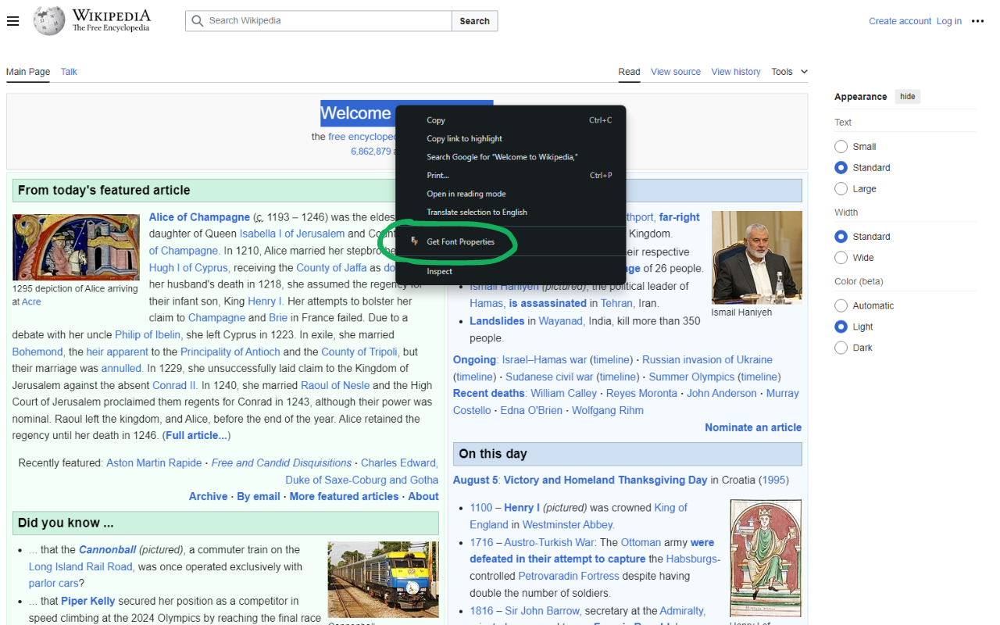
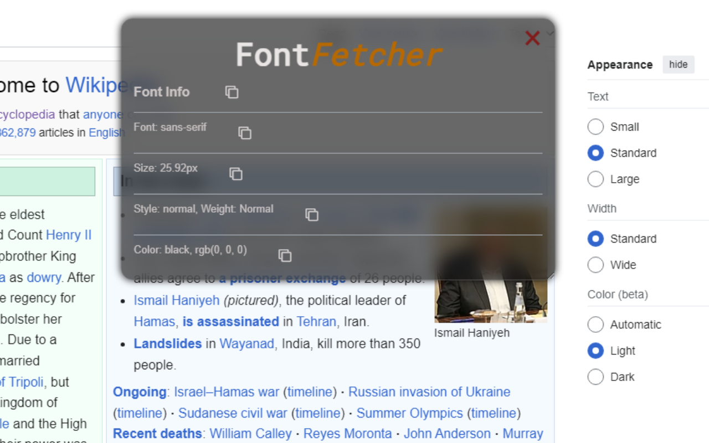

# Font Fetcher
> Google Chrome Extension to easily retreive and copy font properties of selected text.

<details>
<summary>Contents</summary>

- [Overview](#overview)
- [Architecture](#architecture)
  - [Font Extraction](#font-extraction)
  - [Copy to Clipboard](#copy-to-clipboard)
  - [Colour Mapping](#colour-mapping)
- [Video Demonstration](#video-demonstration)
- [Contact](#contact)

</details>

# Overview
<table width="100%" cellspacing="0" cellpadding="0">
  <tr>
    <td width="50%">
      
    </td>
    <td width="50%">
      
    </td>
  </tr>
</table>

I built Font Fetcher as a capstone project for <a href="https://pll.harvard.edu/course/cs50-introduction-computer-science">CS50X</a> 2024 (Harvard's CS50 Introduction to Computer Science)
- Font Fetcher is a Chrome extension that allows users to highlight text on a webpage and retrieve its font properties, including family, size, weight, and color.  

## Built With
- 
- 
- 
-  Extension APIs

# Architecture
## Font Extraction
The core algorithm uses getComputedStyle() on a temporary <span> containing the user's highlighted text. Highlighted text is accessed with getSelection(), and range() / surroundContents() methods.

```js
const selection = window.getSelection();
if (selection.rangeCount > 0) {
    const range = selection.getRangeAt(0);
    const span = document.createElement("span");
    range.surroundContents(span);

    // retrieve properties on the span container (highlighted text)
    const textCS = window.getComputedStyle(span);
}
```

## Copy to Clipboard
The copyTextToClipboard() function uses the navigator API to copy font property data from the span elements to the user's clipboard.

```js
function copyTextToClipboard(text, property) {
    navigator.clipboard.writeText(text);
}
```

## Colour Mapping
RGB values are converted to the closest color name using Euclidean distance calculations.  

```js
function colorDistance(color1, color2) {
    const [r1, g1, b1, a1] = color1;
    const [r2, g2, b2, a2] = color2;
    return Math.sqrt((r1 - r2) ** 2 + (g1 - g2) ** 2 + (b1 - b2) ** 2 + (a1 - a2) ** 2);
}
```

<details>
<summary>findClosestColor()</summary>


```js
function findClosestColor(rgbColor) {
    const colorNamesRGBA = {};
    for (const [name, rgb] of Object.entries(colorNames)) {
        const [r, g, b] = rgb.match(/\d+/g).map(Number);
        colorNamesRGBA[name] = [r, g, b, 1];
    }

    const [r1, g1, b1] = rgbColor.match(/\d+/g).map(Number);
    const inputColor = [r1, g1, b1, 1];

    let closestColor = null;
    let minDistance = Infinity;

    for (const [name, color] of Object.entries(colorNamesRGBA)) {
        const distance = colorDistance(inputColor, color);
        if (distance < minDistance) {
            minDistance = distance;
            closestColor = name;
        }
    }

    return closestColor;
}
```
</details>

# Video Demonstration
https://youtu.be/MXVYI6_wm88?si=i66EWkZt4MWNIyJo

## Contact 
[`email`](mailto:jeevansanchez42@gmail.com)&nbsp;&nbsp;&nbsp; [``LinkedIn``](https://linkedin.com/in/jeevansanchez)
